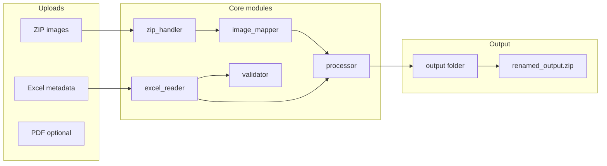

# PW Workflow Automation Tool

Production-ready Streamlit application that automates renaming of question and solution images from a test paper batch. Replaces manual PDF screenshot workflows by pairing images from a ZIP archive using Excel metadata.

## Project overview

A typical batch contains:

1. **ZIP** — question (`QUES_ENG_*.png`) and solution (`SOLU_ENG_*.png`) images sharing a unique ID
2. **Excel** — metadata with display order and question image filenames
3. **PDF** (optional) — question paper for reference validation only

The tool produces:

```
Q1.png  S1.png
Q2.png  S2.png
...
Qn.png  Sn.png
```

packaged as `renamed_output.zip`.

## Architecture



| Module | Responsibility |
|--------|----------------|
| `zip_handler.py` | Validate, extract, and package ZIP archives |
| `excel_reader.py` | Read Excel with flexible column detection |
| `image_mapper.py` | Build `unique_id → {question, solution}` index |
| `validator.py` | ZIP, Excel, and cross-file validation |
| `processor.py` | Rename pipeline, reports, timing |
| `utils.py` | Regex-based `extract_unique_id()` |
| `logger.py` | File logging to `logs/processing.log` |
| `ui.py` | Streamlit UI sections |

## Installation

**Requirements:** Python 3.11+

```bash
cd pw_workflow_tool
python -m venv .venv

# Windows
.venv\Scripts\activate

# macOS / Linux
source .venv/bin/activate

pip install -r requirements.txt
```

## Running locally

From the `pw_workflow_tool` directory:

```bash
streamlit run app.py
```

Open the URL shown in the terminal (typically `http://localhost:8501`).

### Workflow in the UI

1. **Upload Files** — ZIP (required), Excel (required), PDF (optional)
2. **Validation Results** — file counts, column mapping, warnings
3. Click **Run cross-validation & preview** — see first 5 mappings (`Q1 → QUES_… → SOLU_…`)
4. **Processing Status** — click **Process and generate output**
5. **Download Results** — `renamed_output.zip`, CSV report, JSON report

## Folder structure

```
pw_workflow_tool/
├── app.py                 # Streamlit entry point
├── requirements.txt
├── README.md
├── src/
│   ├── ui.py
│   ├── validator.py
│   ├── processor.py
│   ├── image_mapper.py
│   ├── excel_reader.py
│   ├── zip_handler.py
│   ├── utils.py
│   └── logger.py
├── logs/
│   └── processing.log     # Created at runtime
└── output/
    └── Q1.png, S1.png, …  # Created at runtime
```

## Reference data format

Validated against sample inputs using:

| Excel column | Example |
|--------------|---------|
| `Display Order*` | `1`, `2`, … `45` |
| `Question Image` | `QUES_ENG_fggct35vp5l1m8gyjj540mdzs.png` |
| `QBG Question id` | `fggct35vp5l1m8gyjj540mdzs` |

| ZIP filename | Role |
|--------------|------|
| `QUES_ENG_{id}.png` | Question |
| `SOLU_ENG_{id}.png` | Solution |

## Troubleshooting

| Issue | Action |
|-------|--------|
| ZIP validation fails | Re-export the archive; ensure it is not password-protected |
| Excel column not found | Rename headers to include “Display Order” and “Question Image”, or use the documented aliases |
| Missing solution warnings | Confirm `SOLU_ENG_{same_id}.png` exists in the ZIP |
| QBG id ≠ image id warning | File matching uses the ID from **Question Image**; align QBG column if needed |
| Excel upload | Use **.xlsx** only (not legacy `.xls`) |
| Corrupted PNG warnings | Re-export images from the source system |
| Empty output ZIP | Check validation warnings; at least one question image must copy successfully |
| Logs | Inspect `logs/processing.log` for full detail |

## Future improvements

- PDF page-to-question cross-check (requires PDF parsing library)
- Batch processing of multiple test papers in one session
- Drag-and-drop folder upload
- Configurable output naming pattern (`Q{n}`, custom prefix)
- Docker deployment image

## Screenshots

<!-- Add screenshots after first run -->
| Screen | Placeholder |
|--------|-------------|
| Upload | `docs/screenshots/upload.png` |
| Validation | `docs/screenshots/validation.png` |
| Download | `docs/screenshots/download.png` |

## License

Internal use — PW Workflow Automation Tool.
